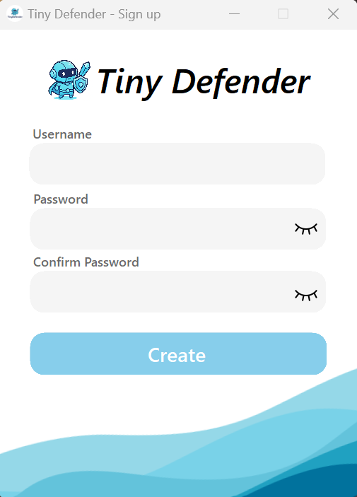
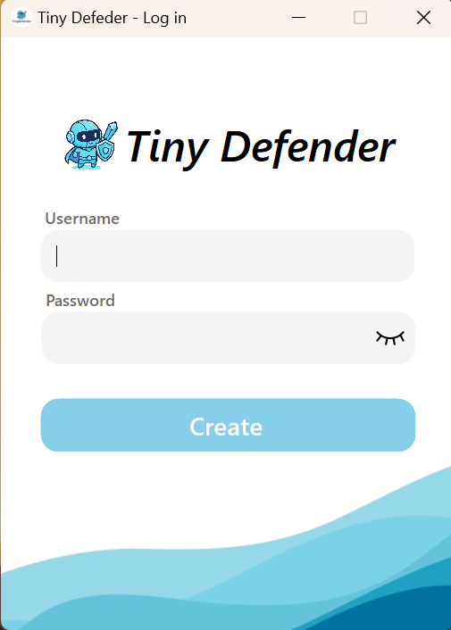
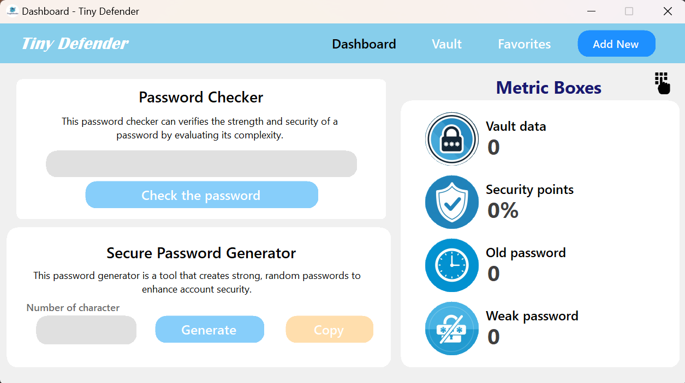
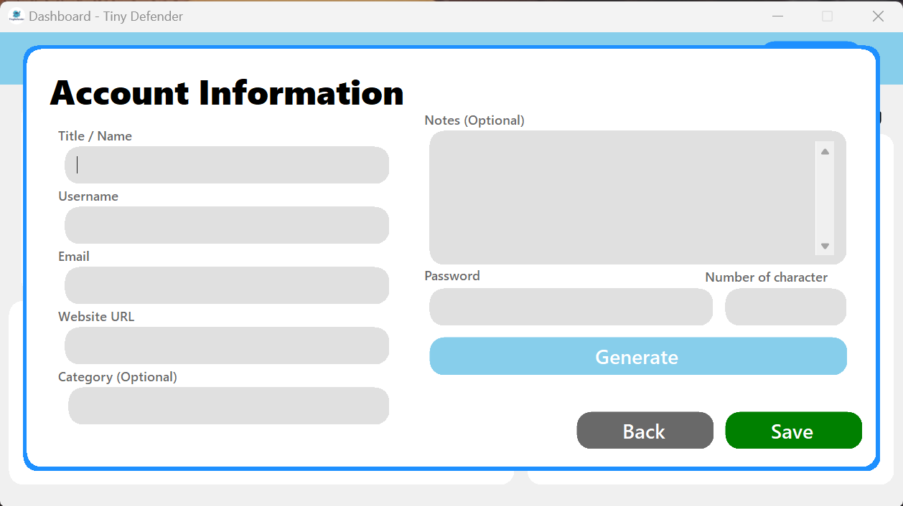
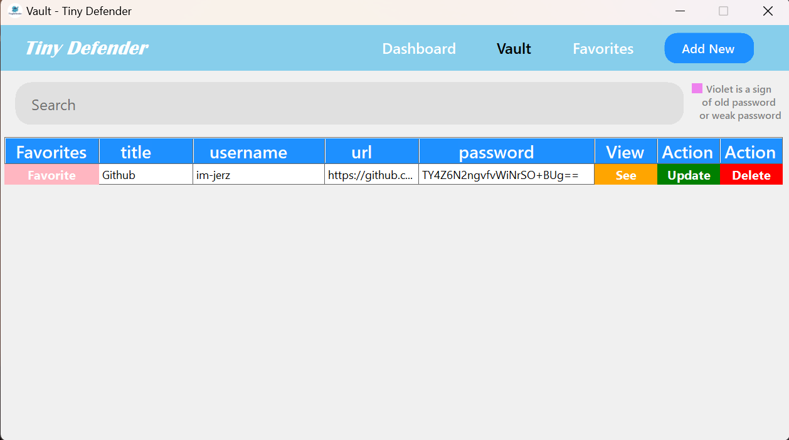
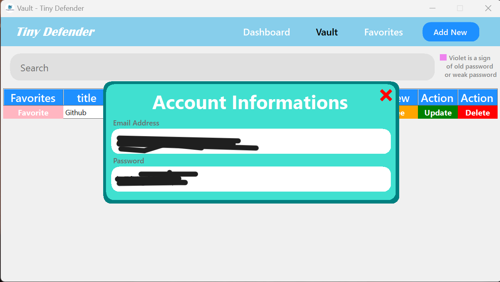
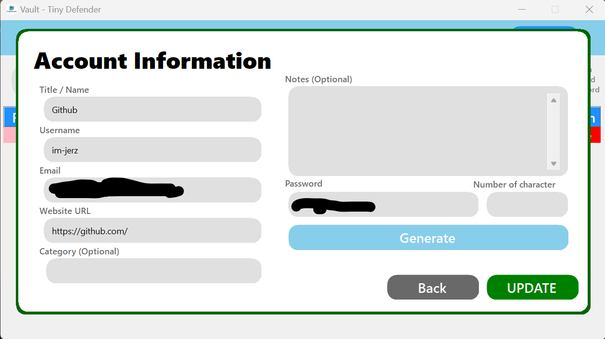
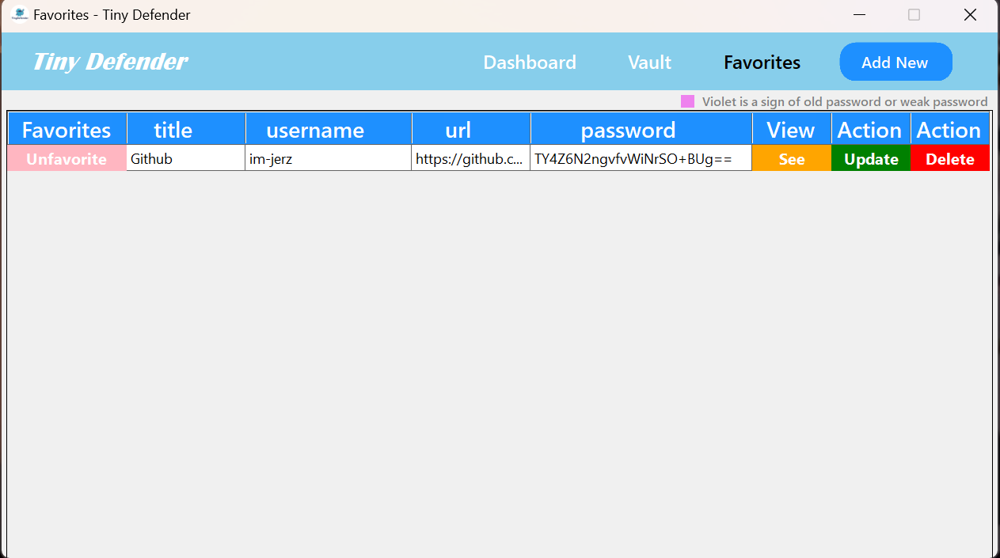

# 🛡️ Tiny Defender v1.0

A sleek and secure **Password Manager** built with **VB.NET (Windows Forms)** — designed to help users securely store and manage passwords for both personal and professional use.

> ⚠️ *Tiny Defender is a local-first, offline password vault. It does not use the cloud or external storage. Your data is stored ****only on your machine****.*

---

## 🚀 Features

* 🔐 Master password protection
* 🧠 Strong password generator
* 💃 Secure password vault with encryption
* 📅 Timestamped entries for audit/history
* 📌 Favorites tagging and management
* 🖥️ Simple Windows Forms UI for ease of use
* 💾 Data saved locally in SQLite format

---

## 🛠️ Tech Stack

* **Language:** VB.NET
* **UI:** Windows Forms
* **Database:** SQLite (local)

---

## 🖼️ Screenshots

### Signup Form


### Login Form


### Dashboard Form


### Auth Code Form


### Add Form


### Vault Form


### See Form


### Update Form


### Favorites Form


---

## 📦 Installation

### 🔧 Requirements

* Windows OS
* [.NET Framework 4.x](https://dotnet.microsoft.com/en-us/download/dotnet-framework)
* Administrator privileges (optional, for saving in protected directories)

### 📅 How to Run

1. Clone this repository:

   ```bash
   git clone https://github.com/im-jerz/Tiny-Defender-v1.0.git
   ```

2. Open the `.sln` file in Visual Studio.

3. Build and run the project.

---

## 📚 Documentation

All logic and controls are managed via VB.NET WinForms.
You can review individual modules for:

* `LoginForm.vb` → Entry point and master password validation
* `MainForm.vb` → Password vault and user interaction
* `Generator.vb` → Strong password generation logic
* `Database.vb` → SQLite connection and query execution

> *Documentation comments and region blocks are provided throughout the code.*

---

## 📄 License

This software is licensed under a **custom EULA**.

By using or installing Tiny Defender, you agree to the [License Agreement](./license.txt), which includes the following:

### ✅ You May:

* Use Tiny Defender on one (1) Windows device.
* Use it for personal or business password management.

### ❌ You May Not:

* Redistribute, sell, or reverse-engineer the software.
* Modify the code or bypass security features.

> ⚖️ This agreement is governed by the laws of the **Philippines**.

---

## 🤛🏻 Author

Developed by [im-jerz](https://github.com/im-jerz)
For feedback or collaboration, feel free to open an issue or fork the repo.

---

## 💡 Future Ideas

* 🔄 Cloud sync or backup option (optional & encrypted)
* 📱 Cross-platform support via MAUI or Electron
* 🧹 Browser autofill integration

---

## ⭐ Star This Repo!

If you find this project useful, consider giving it a ⭐ on GitHub. It helps others discover it too!
